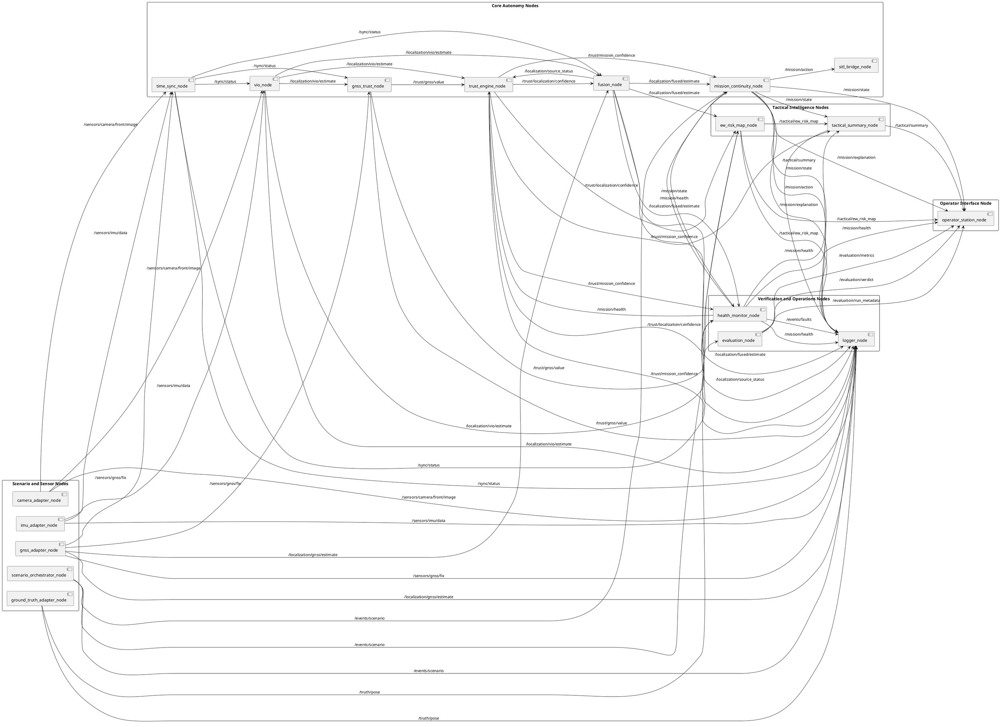

# Runtime Node Graph

## Purpose

This file defines the runtime ROS2 graph and dataflow ownership of JamShield Recon-X Sim.

It complements the higher-level architecture documents by describing how runtime nodes, topic families, tactical outputs, logging, and evaluation boundaries interact during a deterministic simulation run.

## Runtime Graph Principles

- The runtime is simulation-first and all runtime inputs originate from the scenario and simulated sensor stack.
- Ground truth remains evaluation-only and is not part of the runtime autonomy loop.
- Confidence-aware localization is implemented through separate localization, trust, and mission decision stages.
- Deterministic mission continuity is produced by explicit runtime logic, not by implicit estimator behavior.
- Logging and replay are first-class observers of runtime behavior but do not influence autonomy decisions.

## Node Grouping

### Scenario and Sensor Nodes

- `scenario_orchestrator_node`
- `camera_adapter_node`
- `imu_adapter_node`
- `gnss_adapter_node`
- `ground_truth_adapter_node`

### Core Autonomy Nodes

- `time_sync_node`
- `gnss_trust_node`
- `vio_node`
- `fusion_node`
- `trust_engine_node`
- `mission_continuity_node`
- `sitl_bridge_node`

### Tactical Intelligence Nodes

- `ew_risk_map_node`
- `tactical_summary_node`

### Verification and Operations Nodes

- `health_monitor_node` (architecture target, deferred in executable slice)
- `logger_node` (architecture target; current slice uses file artifacts instead)
- `evaluation_node` (architecture target; current slice uses file-based replay/evaluation instead)

### Operator Interface Node

- `operator_station_node`

## Runtime Loop Description

1. `scenario_orchestrator_node` loads the `scenario_manifest`, applies the deterministic run configuration, and publishes scenario lifecycle events on `/events/*`.
2. `camera_adapter_node`, `imu_adapter_node`, and `gnss_adapter_node` publish simulated sensor data on `/sensors/*`. `ground_truth_adapter_node` publishes evaluation-only data on `/truth/*`.
3. `time_sync_node` validates timestamp alignment and freshness across `/sensors/*` and publishes sync state on `/sync/*`.
4. `gnss_trust_node` evaluates GNSS behavior using GNSS observations, sync status, and non-GNSS motion context, then publishes GNSS trust on `/trust/*`.
5. `vio_node` consumes camera and IMU data and publishes VIO localization outputs on `/localization/*`.
6. `fusion_node` receives GNSS localization, VIO localization, sync state, and trust-derived source confidence, then publishes the fused localization estimate and source status on `/localization/*`.
7. `trust_engine_node` aggregates GNSS trust, localization confidence, VIO trust, and sync quality into `mission_confidence` outputs on `/trust/*`.
8. `mission_continuity_node` consumes trust confidence outputs, effective VIO state, GNSS state, and scenario progress, then publishes deterministic mission state, action, and explanation on `/mission/*`.
9. `sitl_bridge_node` consumes mission actions and sends simulator control inputs to the simulated vehicle.
10. The simulator responds to those inputs, producing the next sensor cycle for the runtime loop.
11. In parallel, `ew_risk_map_node` and `tactical_summary_node` consume runtime state and produce tactical outputs on `/tactical/*`.
12. In the current executable slice, file artifacts under `artifacts/runs/<run_id>/` play the observer role that future `logger_node` and `evaluation_node` instances will own in ROS2.

## Topic-Level Dataflow

| Topic | Publisher | Primary Consumers | Purpose | Runtime Critical? | Evaluation Only? |
| --- | --- | --- | --- | --- | --- |
| `/events/scenario` | `scenario_orchestrator_node` | `mission_continuity_node`, `ew_risk_map_node`, `logger_node` | Publishes scenario lifecycle and deterministic event timing. | Yes | No |
| `/events/faults` | `health_monitor_node` | `logger_node` | Publishes detected runtime fault events. | No | No |
| `/sensors/camera/front/image` | `camera_adapter_node` | `vio_node`, `time_sync_node`, `logger_node` | Supplies camera input for VIO and sync validation. | Yes | No |
| `/sensors/imu/data` | `imu_adapter_node` | `vio_node`, `time_sync_node`, `logger_node` | Supplies inertial input for VIO and sync validation. | Yes | No |
| `/sensors/gnss/fix` | `gnss_adapter_node` | `gnss_trust_node`, `time_sync_node`, `logger_node` | Supplies GNSS observations for trust estimation and sync validation. | Yes | No |
| `/sync/status` | `time_sync_node` | `gnss_trust_node`, `vio_node`, `fusion_node`, `health_monitor_node`, `logger_node` | Publishes simulation time alignment and freshness state. | Yes | No |
| `/localization/gnss/estimate` | `gnss_adapter_node` | `fusion_node`, `logger_node` | Publishes GNSS-derived localization estimate. | Yes | No |
| `/localization/vio/estimate` | `vio_node` | `gnss_trust_node`, `fusion_node`, `trust_engine_node`, `health_monitor_node`, `logger_node` | Publishes VIO localization estimate and estimator quality context. | Yes | No |
| `/localization/fused/estimate` | `fusion_node` | `mission_continuity_node`, `ew_risk_map_node`, `health_monitor_node`, `logger_node` | Publishes confidence-aware fused localization output. | Yes | No |
| `/localization/source_status` | `fusion_node` | `trust_engine_node`, `logger_node` | Publishes active localization mode and source gating status. | Yes | No |
| `/trust/gnss/value` | `gnss_trust_node` | `trust_engine_node`, `ew_risk_map_node`, `logger_node` | Publishes GNSS trust and GNSS anomaly outputs. | Yes | No |
| `/trust/localization/confidence` | `trust_engine_node` | `fusion_node`, `ew_risk_map_node`, `logger_node` | Publishes localization confidence for confidence-aware localization and tactical interpretation. | Yes | No |
| `/trust/mission_confidence` | `trust_engine_node` | `mission_continuity_node`, `tactical_summary_node`, `health_monitor_node`, `logger_node` | Publishes aggregated mission confidence for downstream mission continuity and tactical outputs. | Yes | No |
| `/mission/state` | `mission_continuity_node` | `tactical_summary_node`, `health_monitor_node`, `operator_station_node`, `logger_node` | Publishes deterministic mission state. | Yes | No |
| `/mission/action` | `mission_continuity_node` | `sitl_bridge_node`, `logger_node` | Publishes mission actions sent to the simulator. | Yes | No |
| `/mission/explanation` | `mission_continuity_node` | `operator_station_node`, `logger_node` | Publishes mission-state explanations and reasoned transition context. | No | No |
| `/mission/health` | `health_monitor_node` | `trust_engine_node`, `mission_continuity_node`, `tactical_summary_node`, `operator_station_node`, `logger_node` | Publishes runtime health state for autonomy and operator visibility. | Yes | No |
| `/tactical/ew_risk_map` | `ew_risk_map_node` | `tactical_summary_node`, `operator_station_node`, `logger_node` | Publishes tactical EW risk representation derived from runtime degradation evidence. | No | No |
| `/tactical/summary` | `tactical_summary_node` | `operator_station_node`, `logger_node` | Publishes tactical summary outputs for operator interpretation. | No | No |
| `/truth/pose` | `ground_truth_adapter_node` | `logger_node`, `evaluation_node` | Publishes evaluation-only ground truth pose. | No | Yes |
| `/evaluation/run_metadata` | `evaluation_node` | `operator_station_node` | Publishes replay and evaluation metadata. | No | Yes |
| `/evaluation/metrics` | `evaluation_node` | `operator_station_node` | Publishes evaluation metrics. | No | Yes |
| `/evaluation/verdict` | `evaluation_node` | `operator_station_node` | Publishes final evaluation verdict. | No | Yes |

## Runtime-Critical Paths

### GNSS trust path

`gnss_adapter_node -> /sensors/gnss/fix -> gnss_trust_node -> /trust/gnss/value -> trust_engine_node`

This path detects GNSS degradation and produces `gnss_trust`. It is runtime-critical because downstream confidence aggregation depends on it, but it is not itself a mission decision path.

### VIO fallback path

`camera_adapter_node + imu_adapter_node -> /sensors/* -> vio_node -> /localization/vio/estimate -> trust_engine_node and fusion_node`

This path provides non-GNSS localization continuity. It becomes critical when GNSS trust degrades and fallback localization is required.

### Localization fusion path

`gnss_adapter_node + vio_node + trust_engine_node + time_sync_node -> fusion_node -> /localization/fused/estimate`

This path implements confidence-aware localization. `fusion_node` consumes trust-derived localization confidence, but fusion is not trust aggregation.

### Trust aggregation path

`gnss_trust_node + vio_node + health_monitor_node + fusion_node -> trust_engine_node -> /trust/localization/confidence and /trust/mission_confidence`

This path aggregates trust signals and estimator condition into localization confidence, `mission_confidence`, and related trust outputs. It does not produce mission decisions or control commands.

### Mission decision path

`fusion_node + trust_engine_node + health_monitor_node + scenario_orchestrator_node -> mission_continuity_node -> /mission/action -> sitl_bridge_node`

This path produces deterministic mission continuity decisions. `mission_continuity_node` is the sole producer of mission state and mission action outputs.

### Tactical risk path

`gnss_trust_node + trust_engine_node + fusion_node + scenario_orchestrator_node -> ew_risk_map_node -> tactical_summary_node`

This path derives tactical intelligence from runtime evidence. It does not close the autonomy loop and does not replace mission continuity.

## Evaluation Boundary

`/truth/*` topics are evaluation-only.

- `ground_truth_adapter_node` may publish `/truth/*`.
- `logger_node` may record `/truth/*`.
- `evaluation_node` may consume `/truth/*`.
- Runtime autonomy nodes must not consume `/truth/*`.
- Tactical intelligence nodes must not consume `/truth/*`.

Ground truth is not a runtime input. Evaluation is not runtime autonomy.

## Logging and Replay Observation Model

`logger_node` passively records runtime, tactical, event, and truth data.

- It observes the system through subscriptions.
- It does not publish into runtime-critical topic families.
- It does not participate in trust computation, localization fusion, or mission continuity.
- It provides the recorded evidence needed for deterministic replay and offline evaluation.

`evaluation_node` consumes recorded runtime outputs together with `/truth/*` during replay. It remains outside the runtime autonomy loop.

## Operator Visibility

`operator_station_node` should observe:

- localization state through `/localization/*` derivatives exposed via mission and tactical outputs
- mission state through `/mission/state`
- trust signals through derived runtime summaries and explanations
- tactical summaries through `/tactical/*`
- evaluation outputs through `/evaluation/*` when replay results are available

`operator_station_node` is operator-facing only. It does not publish runtime control decisions during deterministic runs.

## Design Discipline Notes

- Node naming is locked by `terminology-lock.md`.
- Topic families are controlled and may change only through architecture review.
- Runtime autonomy and evaluation must remain separated.
- `gnss_trust`, `mission_confidence`, and related trust outputs are not mission decisions.
- Mission continuity is not raw localization and is not produced by `fusion_node`.
- `trust_engine_node` aggregates trust signals and does not publish control commands.
- Tactical outputs do not control the runtime autonomy loop.
- The core autonomy loop ends at `sitl_bridge_node`.

## PlantUML Runtime Graph

