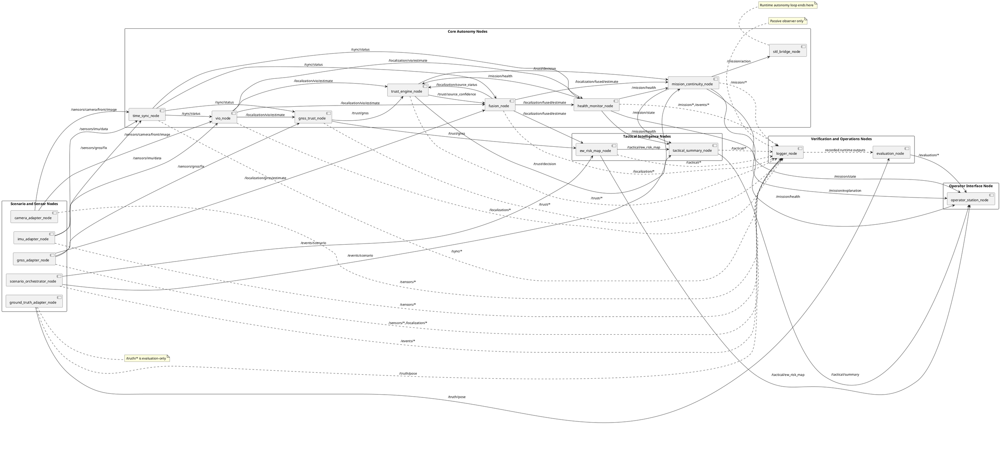

# Runtime Dataflow Diagram

## Purpose

This file defines the runtime data movement and control boundaries of JamShield Recon-X Sim.

It focuses on how runtime data moves through the ROS2 graph, where mission decisions are produced, how tactical outputs are derived, and how logging and evaluation remain separated from runtime autonomy.

## Dataflow Modeling Rules

- The runtime autonomy loop is separate from evaluation.
- Ground truth is evaluation-only and must not enter runtime autonomy.
- `gnss_trust_node` produces GNSS trust, not mission decisions.
- `fusion_node` produces fused localization, not final mission confidence.
- `trust_engine_node` produces trust decisions and source confidence, not control commands.
- `mission_continuity_node` consumes trust and localization state to produce deterministic mission decisions.
- `logger_node` is passive and records data without influencing runtime behavior.
- `evaluation_node` performs observer-side replay and analysis using recorded runtime outputs and `/truth/*`.

## Core Runtime Flow

1. `scenario_orchestrator_node` starts the run, loads the `scenario_manifest`, and publishes scenario lifecycle events on `/events/*`.
2. `camera_adapter_node`, `imu_adapter_node`, and `gnss_adapter_node` publish simulated sensor data on `/sensors/*`.
3. `time_sync_node` validates timing alignment and freshness across the sensor streams and publishes `/sync/*`.
4. `gnss_trust_node` consumes GNSS observations, sync state, and non-GNSS motion context to produce GNSS trust on `/trust/*`.
5. `vio_node` consumes camera and IMU data and produces VIO localization outputs on `/localization/*`.
6. `gnss_adapter_node` also provides GNSS-derived localization on `/localization/*`.
7. `trust_engine_node` combines trust and runtime health context to produce source confidence and trust decisions on `/trust/*`.
8. `fusion_node` consumes GNSS localization, VIO localization, source confidence, and sync state to produce fused localization and source status on `/localization/*`.
9. `mission_continuity_node` consumes fused localization, trust decisions, mission health, and scenario progress to produce deterministic mission state, mission action, and mission explanation on `/mission/*`.
10. `sitl_bridge_node` consumes `/mission/*` action outputs and closes the control loop with the simulator.
11. The simulator responds to the mission action, producing the next sensor cycle.

## Tactical Dataflow

`ew_risk_map_node` consumes:

- `/trust/*`
- `/localization/*`
- `/events/*`

It publishes tactical EW risk outputs on `/tactical/*`.

`tactical_summary_node` consumes:

- `/tactical/*`
- `/mission/*`
- `/trust/*`

It publishes tactical summaries on `/tactical/*`.

Tactical outputs reach the operator through `operator_station_node`. Tactical outputs do not control the vehicle and do not replace mission continuity.

## Evaluation and Logging Boundary

`logger_node` subscribes passively to:

- `/events/*`
- `/sensors/*`
- `/sync/*`
- `/localization/*`
- `/trust/*`
- `/mission/*`
- `/tactical/*`
- `/truth/*`

It records runtime evidence without participating in trust, fusion, or mission decision logic.

`evaluation_node` consumes:

- recorded runtime outputs
- `/truth/*`

It produces `/evaluation/*` outputs for replay, metrics, and verdicts.

`/truth/*` never enters runtime autonomy.

## Operator Visibility

`operator_station_node` observes:

- localization outputs through mission and tactical runtime products
- trust-related outputs through mission explanations and tactical outputs
- mission state through `/mission/state`
- tactical summaries through `/tactical/*`
- evaluation outputs through `/evaluation/*` when available

`operator_station_node` is a visibility endpoint only. It does not publish runtime control commands during deterministic runs.

## PlantUML Runtime Dataflow Diagram

